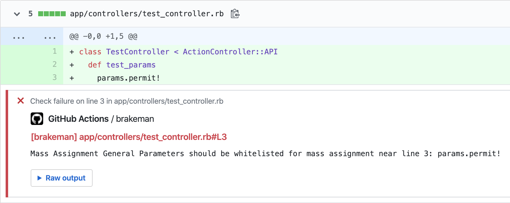
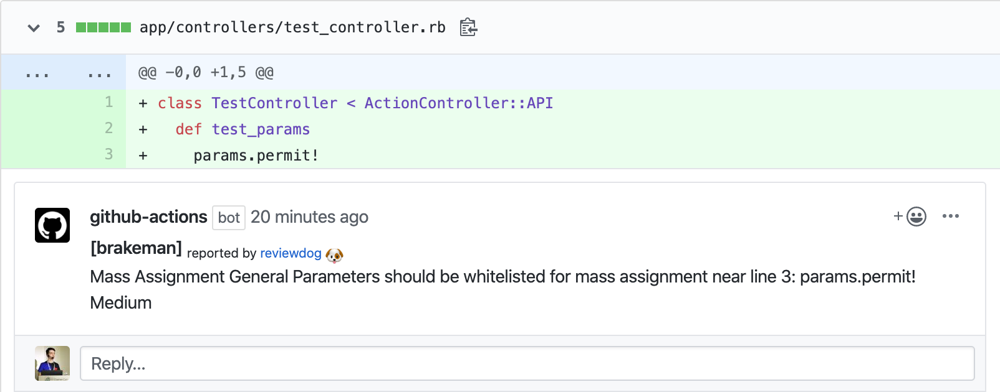

# GitHub Action: Run brakeman with reviewdog 🐶

[](./LICENSE)
[](https://github.com/reviewdog/action-brakeman/actions?query=workflow%3Adepup)
[](https://github.com/reviewdog/action-brakeman/actions?query=workflow%3Arelease)
[](https://github.com/reviewdog/action-brakeman/releases)
[](https://github.com/haya14busa/action-bumpr)

This action runs [brakeman](https://github.com/presidentbeef/brakeman) with
[reviewdog](https://github.com/reviewdog/reviewdog) on pull requests to improve
code review experience.

## Examples

### With `github-pr-check`

By default, with `reporter: github-pr-check` an annotation is added to the line:



### With `github-pr-review`

With `reporter: github-pr-review` a comment is added to the Pull Request Conversation:



## Inputs

### `github_token`

`GITHUB_TOKEN`. Default is `${{ github.token }}`.

### `brakeman_version`

Optional. Set brakeman version. 
* empty or omit: install latest version
* `gemfile`: install version from Gemfile (`Gemfile.lock` should be presented, otherwise it will fallback to latest bundler version)
* version (e.g. `4.8.2`): install said version

### `brakeman_flags`

Optional. Brakeman flags. (brakeman --quiet --format tabs --no-exit-on-warn --no-exit-on-error `<brakeman_flags>`)

### `tool_name`

Optional. Tool name to use for reviewdog reporter. Useful when running multiple
actions with different config.

### `level`

Optional. Report level for reviewdog [`info`, `warning`, `error`].
It's same as `-level` flag of reviewdog.

### `reporter`

Optional. Reporter of reviewdog command [`github-pr-check`, `github-pr-review`].
The default is `github-pr-check`.

### `filter_mode`

Optional. Filtering mode for the reviewdog command [`added`, `diff_context`, `file`, `nofilter`].
Default is `added`.

### `fail_on_error`

Optional.  Exit code for reviewdog when errors are found [`true`, `false`]
Default is `false`.

### `reviewdog_flags`

Optional. Additional reviewdog flags.

### `workdir`

Optional. The directory from which to look for and run brakeman. Default `.`.

## Example usage

```yml
name: reviewdog
on: [pull_request]
jobs:
  brakeman:
    name: runner / brakeman
    runs-on: ubuntu-latest
    steps:
      - name: Check out code
        uses: actions/checkout@v3
      - name: Set up Ruby
        uses: ruby/setup-ruby@v1
        with:
          ruby-version: 3.0.3
      - name: brakeman
        uses: reviewdog/action-brakeman@v2
        with:
          brakeman_version: 4.8.2
          reporter: github-pr-review # Default is github-pr-check
```

## Sponsor

<p>
  <a href="https://evrone.com/?utm_source=action-brakeman">
    
  </a>
</p>

## License

[MIT](https://choosealicense.com/licenses/mit)
